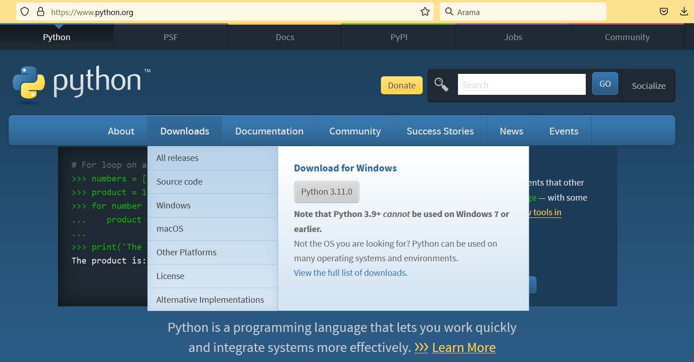
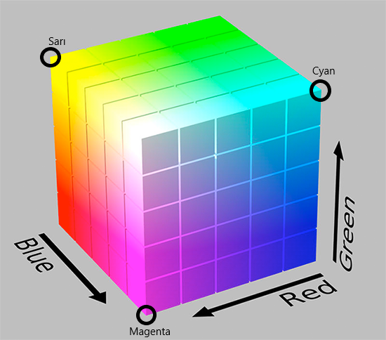

<h1>EESEC 448</h1>
<p align="justify" style="font-family: Calibri">Merhaba arkadaşlar. Dersimizde mühendisler, bilim adamları ve hobiciler tarafından en fazla tercih edilen görüntü işleme kütüphanesi olan <a href="https://opencv.org" target="_blank"><b>OpenCV</b></a>'yi kullanacağız. Bu sayfada <a href="https://opencv.org/course-opencv-for-beginners/"<b>OpenCV for Beginners</b></a> isimli OpenCV resmi kursunu referans alacağız. Bu kursa kayıt ücreti $117. Ben bu kursa çok önceden <a href="https://www.kickstarter.com/projects/opencv/opencv-for-beginners">kickstarter</a>'dan kayıt olup $57 ödemiştim. Ayrıca <b>Adrian Rosebrock</b> tarafından kurulan <a href="https://www.pyimagesearch.com/pyimagesearch-university/"><b>PyImageSearch University</b></a> diğer çok önemli bir referansımız. Bu plana yaklaşık olarak $300 gibi bir ücretle kaydolabiliyorsunuz. Adrian'ın <b>PyImageSearch University</b> planında </b>OpenCV 101 — OpenCV Basics</b> kursunda öğretilen konuların hepsini EEM 448'de işleyeceğiz. Sizlerin bu kurs ve planlara kaydolmanız zorunlu değil. Bu sayfayı ve <a href="https://dbs.gumushane.edu.tr/" target="_blank">Ders Bilgi Sistemi</a>'ni (DBS) takip etmeniz yeterli.</p>

<p align="justify">Bu sayfadaki projelerde <b>Python 3.9.6</b> ve dersin yapıldığı zamanda hazır olan en güncel <a href="https://opencv.org/">OpenCV</a> versiyonunu kullanıyor olacağız. Aşağıda açıklamalarını/sonuçlarını gördüğünüz projelerin <b>py</b> uzantılı <b>Python</b> kodlarını yukarıda <b>project</b> isimli dosyada bulabilirsiniz.
<h4>Python Yüklenmesi</h4>
<p align="justify">İnternette genelde <a href="https://www.anaconda.com/">Anaconda</a> paketi ile beraber yüklenen Python'ı biz direk olarak <a href="https://python.org">resmî web sitesinden</a> indireceğiz. Siteye gittiğimizde fare ile "Downloads" sekmesinin üzerine geldiğimizde aşağıdaki gibi bir görüntü karşımıza çıkmakta.</p>

<figure>
    
</figure>

<p align="justify">Gelen sayfada Windows için Python sürümleri yer almakta. Sol taraftaki kararlı sürümlerden aşağıdaki (kırmızı renk ile) gösterilen Python 3.9.6'nın Windows 64-bit için (yeşil renk ile) gösterilen yükleyicisine tıklıyoruz ve <b>python-3.9.6-amd64.exe</b> dosyasını indiriyoruz.</p>

<figure>
    
</figure>

<p align="justify">Yukarıda dikkat edilmesi gereken önemli bir nokta kırmızı renkle gösterilen Python sürümünün altında koyu renkle yazılan not uyarısında belirtilen Windows versiyon uyumluluğu. Eğer bilgisayarda işletim sistemi olarak Windows 7 veya önceki Windows sürümleri yüklüyse o zaman doğal olarak Python 3.9.6'dan daha eski bir sürüm yüklemek gerekir.</p>
<h4>Kullanacağımız Komutlar</h4>
<p align="justify">Masaüstünde <strong>EESEC 448</strong> isimli klasörü oluşturduktan sonra <b>Windows PowerShell</b>'de gerekli <b>cd</b> komutlarıyla bu klasörün içine girin. Sonra <b>sanal ortam</b> (İng. <b>virtual environment</b>) oluşturmak için</p> 

```
python -m venv opencv-env
```

<p align="justify">yazın. Ardından bulunduğunuz dizinde</p> 

```
.\opencv-env\Scripts\activate
```

<p align="justify">komutunu girerek <b>opencv-env</b> isimli sanal ortamı <b>aktif</b> hale getirin. Bunu müteakiben sırasıyla</p> 

```
pip install opencv-contrib-python streamlit jupyter moviepy ipykernel matplotlib
```

ve

```
pip install pyautogui mediapipe mime
```

<p align="justify">komutlarını koşturarak bilgisayarda <b>OpenCV</b> koşturabilmek için gerekli olan bütün <b>paket</b> ve <b>kütüphane</b>leri yükleyin.</p>

<h4>Visual Studio Code'a Sanal Ortamın Kaydedilmesi/Tanıtılması</h4>
<p align="justify">Yukarıdaki videolarda bilgisayarımıza <b>Python</b> yükledikten sonra <b>opencv-env</b> isimli bir <b>sanal ortam</b> oluşturup içerisine <b>OpenCV</b>'yi ve bağımlı olduğu kütüphaneleri yüklemeyi gördük. Derste kullanacağımız <b>Visual Studio Code</b> (VSC) editöründe kod yazarken kullanacağımız <b>OpenCV</b> fonksiyonları hakkında yardım alabilmek için VSC'ye sanal ortamımızı kaydetmemiz/tanıtmamız lazım. Bu işlem için aşağıdaki resme tıklayınca açılan videoyu izleyin.</p>

[](https://youtu.be/6Z5lM1WqBXU)

<p align="justify"><b>Not:</b> Sınavlarda OpenCV'yi bilgisayarımıza direk değil de sanal ortama yüklemeyle/kurmayla ilgili sorular gelecektir.</p>

<h2>Proje 1: Resim Yükleme ve Görüntüleme (load-display-image)</h2>
<h3>Yüklenen Resmin Üzerine Yazı Yazma, Resmi Yeniden Boyutlandırma, Ekranda Görüntüleme ve Dosyaya Kaydetme</h3>
<p align="justify">Bu egzersizde <b>OpenCV</b> kütüphanesinin <b>imread()</b>, <b>putText()</b>, <b>resize()</b>, <b>imshow()</b> ve <b>imwrite()</b> fonksiyonlarını kullanacağız. Resim yüklemek için kullandığımız fonksiyon olan <b>imread()</b>, argüman (yani giriş) olarak uzantısıyla beraber resim/fotoğraf ismi kabul ediyor. Yani fonksiyona <i>string</i> veri tipinde resmin uzantılı ismini giriş olarak veriyoruz. Mesela burada fotoğrafımızın ismi <b>IMG_20210616_202539.jpg</b> olduğundan <b>imread('IMG_20210616_202539.jpg')</b> şeklinde fonksiyonu çağırdığımızda resmi bizim ismini verdiğimiz değişkene atıyor. Bu arada gözden kaçırmayın, bütün fonksiyonları her zaman <b>cv2</b> anahtar kelimemizin sonuna <b>nokta</b> koyup çağırıyoruz, çünkü <b>cv2</b> yazdığımız kodda <b>OpenCV</b> kütüphanesini temsil ediyor. Zaten bu yüzden her kodumuzun başında <b>import cv2</b> diye bir komutla <b>OpenCV</b>'yi aktif hale getirmiş oluyoruz. Sonuç olarak, eğer <b>IMG_20210616_202539.jpg</b> isimli bir fotoğrafı OpenCV'de <b>resim</b> isminde bir değişkene atamak istiyorsak, o zaman aşağıdaki kodu koşturmalıyız.</p>

```
import cv2
resim = cv2.imread('IMG_20210616_202539.jpg')
```

<p align="justify">Aşağıdaki kod resmin <b>yüksekliğini</b> (height), <b>genişliğini</b> (width) ve BGR (Blue-Green-Red yani Mavi-Yeşil-Kırmızı) kanal sayısını (channels) <b>print</b> komutuyla ekrana basıyor. Burada yükseklik <b>satır</b> sayısına, genişlik <b>sütun</b> sayısına eşit. Aşağıdaki kod satırında <b>resim.shape[0]</b> ve <b>resim.shape[1]</b> komutları sırasıyla resmin yükseklik ve genişliğini piksel cinsinden bir sayı olarak ekrana basıyor. Kanal sayısı olan <b>resim.shape[2]</b> hakkında ara sınavdan önceki haftalarda konuşacağız.</p>

```
print('yükseklik = %i   genişlik = %i   kanal sayısı = %i' %(resim.shape[0], resim.shape[1], resim.shape[2]))
```

<p>Aşağıdaki videoyu izleyerek yukarıda bir kısmı açıklanan ve tamamı aşağıda verilen kodu gerçekleyebilirsiniz.</b>

[](https://youtu.be/622veo4_lDw)

```
import cv2 # OpenCV kütüphanesine erişim
resim = cv2.imread('IMG_20210616_202539.jpg') # resim yükle
print('yükseklik = %i   genişlik = %i   kanal sayısı = %i' %(resim.shape[0],resim.shape[1],resim.shape[2]))
# resmin üzerine yazı yazalım
font = cv2.FONT_HERSHEY_SIMPLEX # font tipi
org = (300, 300) # yazının içinde bulunduğu dikdörtgenin sol alt köşesi
fontScale = 7 # font büyüklüğü
color = (0, 0, 0) # BGR sırasında yazının renk kodu
thickness = 12 # yazının kalınlığı
yaziliResim = cv2.putText(resim, 'Gumushane', org, font, fontScale, color, thickness, cv2.LINE_AA)
# resmi yeniden boyutlandır, dosyaya kaydet ve ekranda görüntüle
s = 0.2 # scale - ölçek
dim = (int(s*resim.shape[1]), int(s*resim.shape[0])) # boyut
kucukResim = cv2.resize(yaziliResim, dim, interpolation = cv2.INTER_AREA)
cv2.imwrite('Gumushane.jpg', kucukResim, [cv2.IMWRITE_JPEG_QUALITY, 100])
cv2.imshow("Uzerine yazi yazilmis ve yeniden boyutlandirilmis resim", kucukResim)
cv2.waitKey(0) # klavyede herhangi bir tuşa basana kadar ekranda görüntüle
```

<hr/>
<h2>Proje 2: Web Kamerası (web-cam-stream)</h2>
<p align="justify">Video dediğimiz şey ard arda yakalanan (İng. <b>capture</b>) resimlerin ekranda seri halde görüntülenmesinden başka birşey değil. Burada <b>FPS</b> kavramı karşımıza çıkıyor. Yani <b>Frame per Second</b>, Türkçesi <b>saniyedeki kare sayısı</b>. Aşağıdaki animasyonda [2] aynı hareketin değişik FPS değerlerinde yakalanmış halini görüyorsunuz. Yüksek FPS değerleri ayrıntıları gözlemleyebilmeyi artırsa da daha fazla işlem yapıldığından dolayı bilgisayarı yoracaktır. Karşımıza çıkan FPS kavramını Sinyaller-Sistemler ve Haberleşme derslerinde gördüğünüz <b>örnekleme frekansı</b> (İng. sampling frequency) olarak düşünebilirsiniz.

<p align="center"></p>

<p align="justify">Genelde FPS değeri standart web kameraları için 30. Bilgisayarımızın web kamerasını OpenCV kullanarak aşağıdaki gibi açabiliriz.</p>

```
cap = cv2.VideoCapture(0)
```

<p align="justify">Burada <b>VideoCapture</b> web kamerasına erişmek için bizim kullanımımıza sunulmuş OpenCV'nin <b>videoio</b> ana modülünde yer alan bir sınıf (class). Bu komuta 0 girişini verdik çünkü bilgisayarımızda eğer bir web kamerası varsa OpenCV o kameraya 0 kodunu atamış. Eğer birden fazla kamera varsa, o zaman argüman olarak 0 değil de 1, 2, ... girebiliriz. Bu arada <b>VideoCapture()</b> komutunun bize döndürdüğü değişkene <em>capture</em> kelimesinin kısaltması olan <b>cap</b> ismini uygun bulduk zira <em>capture</em> yakalamak demek ki web kamerası da saniyede otuz kez görüntüyü yakalayarak bize video sağlamış oluyor. OpenCV'de <b>VideoCapture</b> sınıfı web kamerası başarıyla açıldı mı açılmadı mı kontrol etmemiz için Türkçesi <b>acildi mi?</b> olarak tercüme edilebilecek bir fonksiyon kullanımımıza sunuyor: <b>isOpened()</b>. Yukarıda <b>VideoCapture()</b> komutunun bize döndürdüğü <b>cap</b> değişkenini kullanarak kamera açıldı mı açılmadı mı aşağıdaki gibi kontrol edelim.</p>

```
if (cap.isOpened() == False): ## eğer açılmadıysa
    print('Web kamerasına erişimde sorun yaşandı!')
else: ## eğer açıldıysa
    print('Kameranın FPS değeri %i.' %cap.get(cv2.CAP_PROP_FPS))
```

<p align="align>"Eğer kamera yoksa veya erişimde (veya bağlantıda) bir sıkıntı yaşandıysa o zaman ekrana <b>Web kamerasına erişimde sorun yaşandı!</b> yazılacak. Aksi durumda kameradan kareler (İng. frame) sürekli geliyor olacak ve web kamerasının FPS değerini ekrana basacağız. Kameraya başarıyla eriştiğimizi kabul ederek devam ediyoruz. Şimdi görüntü sürekli gelmeye devam edeceğinden, web kamerası kare yakaladığı müddetçe aktif olacak bir döngü oluşturalım. Bu döngü içine her girişte web kamerasından resmi alıp <b>frame</b> isimli bir değişkene atayalım. Döngüden çıkmadan yakalanan renkli resmi ekranda <b>imshow()</b> komutu ile görüntüleyelim ve eğer kullanıcı <b>'q'</b> tuşuna bir an bile basarsa (imlecin görüntülediğimiz video ekranı üzerine tıklı olması lazım) o zaman o anda <b>frame</b> değişkeninde RAM hafızadaki resmi hard diskte dosyaya yazıp hem döngüden çıkalım hem de programı sonlandıralım.</p>

```
import cv2
cap = cv2.VideoCapture(0)
if cap.isOpened() == False:
    print('Web kamerasına erişimde sorun!')
else:
    print('Kameranın FPS değeri %i.' %cap.get(cv2.CAP_PROP_FPS))
while cap.isOpened() == True:
    ret, frame = cap.read() # web kamerası ile kare yakala
    if ret == True: # eğer kareyi yakaladıysak
        cv2.imshow('web kamerasi renkli resim', frame) # yakalanan kareyi ekranda görüntüle
        if cv2.waitKey(1) & 0xFF == ord('q'): # eğer bir an bile q'ya basarsa
            cv2.imwrite('web kamerasi resim.jpg', frame, [cv2.IMWRITE_JPEG_QUALITY, 100]) # dosyaya yaz 
            break # ve döngüden çık
    else: # eğer kareyi yakalayamadıysak
        print('Kare yakalanamadı!') # ekrana uyarı mesajı yaz
        break # ve döngüden çık
cap.release() # release serbest bırak demek
cv2.destroyAllWindows() # bütün pencereleri kapat ve programı sonlandır
```

<p align="align>"Video için aşağıdaki resme tıklayınız.</p>
[](https://youtu.be/0LjEFyVVs0g)

<h2>Proje 3: Filtreleme (filtering)</h2>
<p align="justify">Görüntü işleme denince belki de akla gelen ilk şey olan <b>filtreleme</b> ile devam ediyoruz. Burada OpenCV kütüphanesinin <b>imgproc</b> isimli görüntü işleme ana modülünde bulunan filtrelerden normalize edilmiş kutu filtresi (İng. normalized box filter) <b>blur()</b>, istatistikteki en popüler dağılım olan Gaussian fonksiyonu kullanan Gaussian filtresi <b>GaussianFilter()</b>, yine istatistikte bir algoritma olarak karşımıza çıkan medyan filtresi <b>medianBlur()</b> ve de Gaussian filtresinin piksel şiddet değişimlerinin çok olduğu yerleri bulandırmayan ve resmi aynen Snapshot uygulamasında olduğu gibi oldukça artistik hale getiren versiyonu olan <b>BilateralFilter()</b> komutlarını kullanarak ilk önce web kamerasından gelen video akışını filtreleyeceğiz. Ardından da aynı komutları tek bir resim üzerine uygulayıp sonuçları inceleyeceğiz. Yukarıda isimleri verilen filtrelerle ilgili bir tutorial'a ihtiyacı olanlar derste baktığımız [3]'den faydalanabilirler. Yazdığımız kod aşağıda.</p>

```
import cv2
cap = cv2.VideoCapture(0) # web kamerasını aç
while True:
    ret, frame = cap.read() # frame yakaladığımız görüntü yani kare
    k = 15 # kernel size - pencere boyutu
    # aşağıda değişik filtrelerle resmi filtreleyelim
    filtered = cv2.blur(frame, (k,k))
    # filtered = cv2.GaussianBlur(frame, (k,k), 0)
    # filtered = cv2.medianFilter(frame, k)
    # filtered = cv2.bilateralFilter(frame, k, 90, 90)
    windowText = '(%i x %i) pencere boyutu ile filtrelenmis video' %(k,k)
    cv2.imshow('web kamerasi', frame)
    cv2.imshow(windowText, filtered)
    if cv2.waitKey(1) & 0xFF == ord('q'): # eğer bir an bile q'ya basılırsa -->
        cv2.imwrite('web kamerasi.jpg', frame, [cv2.IMWRITE_JPEG_QUALITY, 100])
        cv2.imwrite('web kamerasi filtrelenmis.jpg', filtered, [cv2.IMWRITE_JPEG_QUALITY, 100])
        break # --> döngüyü sonlandır
cap.release()
cv2.destroyAllWindows()
```

<figure>
    
    <figcaption>Filtreleme sonucu elde edilen resimler<figcaption>
</figure>

<h2>Proje 4: Görüntü İşleme Hızını Hesaplama (processing-speed)</h2>
<p align="justify">Filtreleme dersinde kullandığımız <b>BilateralFilter()</b> komutu üç girişe sahipti. İlk girişi olan pencere boyutu parametresinin filtrelemeye olan etkisini yukarıdaki videoda ve derste görmüştük. Bilateral filtre gördüğümüz öbür üç filtreden farklı olarak pencere boyutunun artmasıyla (artan işlem yükünden dolayı) sinyal işleme hızını temsil eden FPS'yi gözle farkedilebilir derecede azaltıyor. Biz de derste bu hızı Python'da <b>time</b> paketini [4] kullanarak FPS'yi hesaplayıp resim üzerine <b>putText()</b> komutu ile yazdıracağız. Aşağıdaki kodun yazılmasını ve koşturulmasını kodun altındaki resme tıklayarak izleyebilirsiniz.</p>

```
import cv2
import time
cap = cv2.VideoCapture(1)
timePrevious = time.time()
while True:
    ret, frame = cap.read()
    filtered = cv2.bilateralFilter(frame, 21, 75, 85)
    timeCurrent = time.time() # şu anki zaman
    elapsedTime = timeCurrent - timePrevious # geçen zaman
    FPS = 1 / elapsedTime
    text = 'FPS = %.2f' %FPS
    filtered = cv2.putText(filtered, text, (30, 50), 0, 1, (0, 0, 0), 1, 1)
    cv2.imshow('bilateral filtre', filtered)
    print('Bilateral filtre %.5fs\'de koştu.' %elapsedTime)
    timePrevious = timeCurrent
    if cv2.waitKey(1) & 0xFF == ord('q'): # eğer bir an bile q'ya basılırsa -->
        break # --> programı sonlandır
cap.release()
cv2.destroyAllWindows()
```

[](https://youtu.be/07E6AFL08DA)

<p align="justify">Dersi hatırlayacak olursak, ilk önce hızını ölçmek istediğimiz <b>BilateralFilter()</b> komutundan hemen önce bilgisayarın içindeki kronometreden faydalanarak <b>timeStart</b> ismiyle zamanı yakalamıştık. Görüntü işlemeyi yaptıktan hemen sonra <b>timeStop</b> ismiyle yine zamanı yakalayıp <b>timeElapsed = timeStop - timeStart</b> şeklinde geçen zamanı hesaplamıştık. Daha sonra kodun üzerinde düşündüğümüzde sonsuz döngüde olduğumuzu göz önünde bulundurarak iki ayrı zaman yakalama yerine sadece bir kez zamanı yakalayarak görüntü işleme hızımızı ölçebileceğimizi anlamıştık. Yukarıdaki kod bu ikinci metoda ait. Bu yöntemde döngünün sonundan başa dönmeden hemen önce <b>timePrevious = timeCurrent</b> şeklinde yukarıda hesapta kullanılan şu anki zamanı bir sonraki adım için geçmiş zaman haline getirme işlemi mutlaka yapılmak zorunda. Döngüye her başlandığında yeri geldiğinde o andaki zaman <b>timeCurrent = time.time()</b> komutuyla zaten yakalanıyor. Bu işin mantığını üzerinde düşünerek anlamanız lazım.

<h2>Proje 5: Piksel Şiddet Değerleri, Renkli (BGR) - Gri Tonlu - Siyah Beyaz Resimler (bgr-gray-bw)</h2>
<p align="justify">İkinci hafta yaptığımız ilk projede öğrendiğimiz bazı bilgileri burada kullanacağız. Şimdi <b>albert_einstein.jpg</b> isminde bir fotoğrafı (yukarıda <b>project/color-space</b> dizininde bulabilirsiniz) OpenCV kullanarak bilgisayarımıza okuyalım ve bu renkli resmi analiz edelim. Aşağıdaki kod resmi okur ve ekrana sırasıyla resmin <b>yüksekliğini</b> ve <b>genişliğini</b> piksel cinsinden basar. Ayrıca fotoğrafın <b>kanal</b> sayısı denilen bilgiyi ekrana yazar.</p>

```
img = cv2.imread('albert_einstein.jpg')
print('Yükseklik = %i piksel   Genişlik = %i piksel' %(img.shape[0], img.shape[1]))
print('Kanal sayısı = %i' %img.shape[2])
```

<p align="justify">Burada kanal sayısının renkli bir resim için üç olduğunu görüyoruz. Bu şekilde üç kanalın oluşturmuş olduğu renkli bir resme <b>RGB</b> resim deniyor. Bu harfler <b>Red</b>-<b>Green</b>-<b>Blue</b> yani <b>Kırmızı</b>-<b>Yeşil</b>-<b>Mavi</b>'den geliyor. <b>Not:</b> İnsan gözünün yaklaşık olarak kırmızıya %30, yeşile %60 ve maviye %10 duyarlı olduğu kabul ediliyor.</p>
<h4>Piksel Şiddet Değerleri</h4>
<p align="align">Python konsolunda yüklenen fotoğrafda ilk pikselin (i.e., sol en üst piksel) şiddet değerine ulaşmak için</p>

```
img[0][0]
```

<p align="justify">yazarız. Alternatif olarak</p>

```
img[0,0]
```

<p align="justify">de yazılabilir. Bize bir dizi halinde üç değer döndürdüğü gibi veri tipini de **uint8** olarak gösteriyor. Bir pikselin şiddet değeri <b>8 bit unsigned integer</b> yani 8 bitlik (1 byte) işaretsiz tam sayı aralığında olabilir. Tek kanal için 0 kodu siyahı, 255 ise beyazı temsil ediyor. Ara değerler gri tonları oluşturuyor. Sonuç olarak üç kanalın farklı kombinasyonları aşağıdaki gibi renkleri oluşturuyor. Aşağıda RGB kübünü görebilirsiniz ([5]'in izni ile).</p>

<p align="center"></p>

<p align="justify">Renkli resmi yukarıda bahsettiğimiz RGB ağırlıkları olan (0.3, 0.6, 0.1) ile gri tonlu bir resme dönüştürmek ve yeni oluşan gri tonlu resimde yukarıda incelediğimiz sol üst pikselin yeni oluşan şiddet değerini görüntülemek için aşağıdaki satırları koşturalım. Burada kullandığımız <b>cvtColor()</b> fonksiyonu <b>convert color</b> kısaltması, Türkçe olarak renk uzayları arasında dönüşüm manasına geliyor.</p>

```
imgGray = cv2.cvtColor(img, cv2.COLOR_BGR2GRAY)
imgGray[0][0]
```

<p align="justify">Görüldüğü gibi artık üç değer yerine tek bir piksel şiddet değeri var. Bütün piksel şiddet değerleri [0-255] aralığında bir tam sayı değeri alıyor.</p>

<p align="center"></p>

<p align="justify">Artık her bir piksel için üç değil bir tane şiddet değeri var. Piksel şiddet değerleri bilgisayar hafızasında <b>uint8</b> veri tipine uygun olan bir <b>byte</b>'da tutuluyor. İkilik sistemi (binary) hatırlayacak olursak: 1 byte = 8 bit. Alabileceği piksel şiddet değerleri toplam 2<sup>8</sup>=256 tane. Burada 0'dan başlandığından dolayı maksimum piksel şiddet değeri 2<sup>8</sup>-1=255 olmakta.</p>

<p align="center"></p>

Yukarıda görseli verilen RGB kübünü inceleyerek renkleri nasıl oluşturduğumuzu anlayabiliriz. **Önemli Not:** OpenCV'de renkli resmin kanal sırası RGB değil BGR'dır. Örnek olarak yukarıda çember içinde gösterilen renklerden sarı rengin kodu (0,255,255). Ara sınav ve final sınavında cyan, magenta, beyaz, siyah veya başka renk kodları sorularıyla karşılaşabilirsiniz.

#### Gri Tonlu Resimden Siyah Beyaz Resim Elde Etme (Eşikleme - Thresholding)
Resimde yer alan her pikselin şiddet değerini eşik değer (İng. threshold) olan T parametresi ile kıyaslayalım. Burada eşik değeri T'nin değer aralığı 0<T<255. Kullanıcı tarafından bu aralıkta bir eşik değer seçiliyor (e.g., T=60). Eğer piksel değeri T'den küçükse o zaman o pikselin değerini 0 yapalım, küçük değil de büyük eşitse o zaman da pikselin değerini maksimum değer olan 255 yapalım. Biraz düşünecek olursak **küçük T değerleri** için **daha beyaz**, **büyük T değerleri** için **daha siyah** bir resim oluşacağını anlayabilirsiniz (sınavda bununla alakalı mutlaka soru oluyor). Eşikleme işlemi için OpenCV'de **threshold()** fonksiyonunu kullanacağız.

```
(T, imgBW) = cv2.threshold(imgGray, T, 255, cv2.THRESH_BINARY)
```

OpenCV'de **threshold** fonksiyonunda biraz garip olan şey T'yi hem girişte hem de çıkışta görmemiz. Şunu bilin ki yukarıdaki kodu koşturursanız çıkışta gözlenen T değeri girişin aynısı oluyor. Kafanız karışmasın.

<p align="center"></p>

Burada OpenCV kullanarak hem **video** hem **gif** animasyonu yapan kodları **project/bgr-gray-bw** dizininde bulabilirsiniz diye ekleyelim.

<p align="center"></p>

<p align="center"></p>

Yukarıda renkli resim, gri tonlu resim ve siyah beyaz resim hakkında anlattıklarımızı izleyebileceğiniz video bağlantısını DBS'de bulabilirsiniz.

## Proje 6: NumPy Kullanarak Gri Tonlu Sentetik Resim Oluşturma
<p align="justify">Ara sınavdan önceki dersimizde <b>numpy</b> paketine erişimi</p> 

```
import numpy as np
```

<p align="justify">komutuyla sağlayıp <b>numpy</b> paketi içinde tanımlı <b>zeros</b> ve <b>ones</b> komutlarıyla boş resim oluşturup bu resmin piksel değerlerine [0-255] arasında değişik değerler atamayı gördük. Aşağıdaki ilk resimde</p>

```
imgBlack = np.zeros((256,256), np.uint8)
imgWhite = 255*np.ones((256,256), np.uint8)
imgGray = 127*np.ones((256,256), np.uint8)
```

kodunda oluşturduğumuz 256 satır 256 sütundan oluşan siyah, beyaz ve gri resimleri görebilirsiniz.

<p align="center"></p>

<p align="justify">Python'da <b>for</b> döngüsü kullanarak oluşturduğumuz 256x256'lık boş resmi dolaştığımız ve yukarıdaki çıktının aksine dinamik bir şekilde piksel değerlerini manipüle ettiğimiz (e.g., aynı satırdaki piksel değerlerini satır numarasına eşitlemek gibi) kod ve çıktısı da aşağıdadır. Kodların tam hallerini DBS'de ve yukarıda <b>project</b> dizininde <b>numpy</b> projesinde bulabilirsiniz.</p>

```
for i in range(r): # satırları dolaşalım
    for j in range(c): # sütunları dolaşalım
        img[i,j] = i # siz de j veya (i+j)/2 deneyin
```

<p align="center"></p>

<h2>Proje 6 (devam): NumPy Kullanarak Resim Birleştirme</h2>
<p align="justify">Ara sınavdan önceki hafta <b>numpy</b> paketini kullanmaya başladık ve ilk sentetik resimlerimizi (256 x 256 siyah, beyaz ve gri resim) oluşturduk. Sonrasında sentetik resmi oluştururken dinamik ifadeler kullandık ve gri tonlu uzayı değişik desenlerde görselleştirdik (ara sınavda karşımıza çıktı). Bu hafta <b>NumPy</b> kullanmaya devam edeceğiz ve ilk iş olarak iki resmi yatay olarak tek resim haline getireceğiz. Bunun için daha önce ara sınavda karşımıza çıkan filtreleme sorusuna bakalım.</p>

<p align="center"></p>

```
(h,w,c) = img.shape
mimg = np.zeros((2*h,2*w,c), np.uint8) # yeni oluşacak büyük resmin boyutunda boş bir canvas oluştur
mimg[0:h,0:w,:] = img # orijinal resmi sol üste koy
mimg[0:h,w:2*w,:] = filtered1 # filtrelenmiş ilk resmi sağ üste koy
mimg[h:2*h,0:w,:] = filtered2 # filtrelenmiş ikinci resmi sol alta koy
mimg[h:2*h,w:2*w,:] = filtered3 # filtrelenmiş üçüncü resmi sağ alta koy
```

<p align="justify">Burada birleştirilmiş resmi (mimg - merged image) oluştururken fihrist (index) kullanımı önemli. Bunu anlarsanız işler kolaylaşır. <b>NumPy</b> kullanarak birleştirilmiş resim oluşturma final sınavında karşımıza çıkacaktır. Yukarıda verilen resmi üreten kodu <b>numpy_merge_image.py</b> ismiyle <b>numpy</b> projesinde bulabilirsiniz. Sizler de yukarıdaki örnekteki çita resmini (veya kendi tercih ettiğiniz bir resmi) değişik pencere boyutları için <b>blur()</b> filtresinden geçirerek kendi birleştirilmiş resimlerinizi oluşturarak hem NumPy'ı kullanmayı hem de matris fihrislerini öğrenin hem de final sınavına hazırlık yapın. Derste iki web kamerasının görüntülerini birleştirmeye de baktık.</p>

```
cap1 = cv2.VideoCapture(0) # web kamerası 1'i aç
cap2 = cv2.VideoCapture(1) # web kamerası 2'yi aç
while True:
    ret1, frame1 = cap1.read()
    ret2, frame2 = cap2.read()
    (h,w,c) = frame1.shape
    frame1 = cv2.putText(frame1, 'CAM-00', (30,50), 1, 2, (0, 0, 255), 2, 1)
    frame2 = cv2.putText(frame2, 'CAM-01', (30,50), 1, 2, (0, 0, 255), 2, 1)
    # numpy kullanarak stereo resmi birleştirelim
    frame = np.zeros((h,2*w,c), np.uint8)
    frame[0:h,0:w,:] = frame1
    frame[0:h,w:2*w,:] = frame2
    cv2.imshow('web kamerasi stereo', frame)
    if cv2.waitKey(1) & 0xFF == ord('q'): # eğer bir an bile c'ye basarsa
        break
cap1.release()
cap2.release()
cv2.destroyAllWindows()
```

<p align="center"></p>

#### Kendi threshold() Fonksiyonumuzu Yazma ve OpenCV ile Hız Kıyası
<p align="justify">Geçtiğimiz haftalarda OpenCV'nin <b>threshold()</b> komutunu kullanarak bir resmi istediğimiz bir eşik değeri ile siyah-beyaz (binary) hale getirmiştik. Şimdi burada kendi <b>threshold()</b> fonksiyonumuz yazalım ve hız olarak OpenCV ile kıyas etmek için (daha önceden başka yerlerde de kullandığımız) <b>time</b> paketini kullanarak sinyal işleme hızımızı FPS olarak hesaplayıp web kamerası tarafından yakalanan video üzerine yazdıralım.</p>

```
def threshold(gray, T):
    bw = np.zeros_like(gray)
    for i in range(gray.shape[0]): # satırları tara
        for j in range(gray.shape[1]): # sütünlarını tara
            if (gray[i,j] > T):
                bw[i,j] = 255
    return bw
```

<p align="justify">OpenCV'nin <b>threshold()</b> fonksiyonunu aşağıdaki gibi iptal ederek kendi yazdığımız fonksiyonu çağırıyoruz.</p>

```
# T, frameBW = cv2.threshold(frameGray, T, 255, cv2.THRESH_BINARY)
frameBW = threshold(frameGray, T)
```

<h2>Proje 7: Haar Cascade ile Yüz Tespiti (Face Detection with Haar Cascade)</h4>
<p text-align="justify">Kodları yukarıda project/face-detection klasöründe bulabilirsiniz.</p>

<h4>Haar Cascade Metodu ile Resim Üzerinde Yüz Tespiti</h4>

```
print('[INFO] loading face detector...')
detector = cv2.CascadeClassifier('haarcascade_frontalface_default.xml')
img = cv2.imread('image/IMG_20220522_145111.jpg')
gray = cv2.cvtColor(img, cv2.COLOR_BGR2GRAY)
print('[INFO] performing face detection...')
rects = detector.detectMultiScale(gray, scaleFactor=1.05, minNeighbors=5)
print('[INFO] %i face(s) detected.' %len(rects))
for (x,y,w,h) in rects:
    cv2.rectangle(img, (x,y), (x+w,y+h), (0,255,0), 9)
cv2.imshow('face detection with haar cascade', img)
cv2.waitKey(0)
```

<p align="center"></p>

<h4>Haar Cascade Metodu ile Web Kamerası Üzerinde Yüz Tespiti (Final Sınavı Sorusu)</h4>

```
1  import cv2
2  detector = cv2.CascadeClassifier('haarcascade_frontalface_default.xml')
3  cap = cv2.VideoCapture(1)
4  while True:
5      ret, frame = cap.read()
6      gray = cv2.cvtColor(frame, cv2.COLOR_BGR2GRAY)
7      rects = detector.detectMultiScale(gray, scaleFactor=1.05, minNeighbors=5)
8      for (x,y,w,h) in rects:
9          cv2.rectangle(frame, (x,y), (x+w,y+h), (0,255,0), 2)
10     cv2.imshow('Haar Cascade yuz tespiti', frame)
11     if cv2.waitKey(1) == 27: # ESC'ye basarsa programdan çık
12         break
13  cap.release()
14  cv2.destroyAllWindows()
```

<h4>Haar Cascade Metodu ile Web Kamerası Üzerinde Yüz Tespiti (ve FPS hesabı)</h4>

```
import cv2
import time
from collections import deque
import numpy as np
print('[INFO] loading haar cascade face detector...')
detector = cv2.CascadeClassifier('haarcascade_frontalface_default.xml')
cap = cv2.VideoCapture(1)
previousTime = time.time()
fps = deque(maxlen=100)
while True:
    ret, frame = cap.read()
    gray = cv2.cvtColor(frame, cv2.COLOR_BGR2GRAY)
    rects = detector.detectMultiScale(gray, scaleFactor=1.05, minNeighbors=5,
                                    minSize=(30,30), flags=cv2.CASCADE_SCALE_IMAGE)
    for (x,y,w,h) in rects:
        cv2.rectangle(frame, (x,y), (x+w,y+h), (0,255,0), 2)
    currentTime = time.time()
    fpsCurrent = 1 / (currentTime-previousTime)
    fps.append(fpsCurrent)
    fpsAvg = np.mean(fps)
    cv2.putText(frame, 'fps = %.2f' %fpsAvg, (420,30), 0, 1, (0,0,0), 2)
    cv2.imshow('web kamerasi video', frame)
    previousTime = currentTime
    if cv2.waitKey(1) & 0xFF == ord('q'): # eğer bir an bile q'ya basarsa
        cv2.imwrite('face detection haar cascade web cam.jpg', frame, [cv2.IMWRITE_JPEG_QUALITY, 100])
        break
cap.release()
cv2.destroyAllWindows()
```

<p align="center"></p>

<h2>Proje 8: Derin Öğrenme ile Yüz Tespiti (Face Detection with Deep Learning)</h2>
<p align="justify">Burada referans alacağımız tutorial [10]'da Adrian tarafından hazırlanmış. Normalde OpenCV harika bir kütüphane olduğundan böyle tutorial'lar olmadan bile (ne yapacağınızı bildiğiniz takdirde) kendi kodunuzu <a href="https://docs.opencv.org/">OpenCV dökümantasyonu</a>ndan faydalanarak rahatça yazabilirsiniz. Ancak burada bu durum söz konusu değil. Adım adım Adrian'ı takip edeceğiz.</p>

<p align="justify">Adrian OpenCV'nin 2017 Ağustos'unda Deep Neural Network (dnn) ana modülünü (ekstra bir modül değil de standart bir modül olarak) hizmete sunduğunu ve bu modülün içinde derin öğrenme kullanan yüz tespiti metodları olduğunu söylüyor. Bunlardan bir tanesi <a href="https://github.com/arrybn">Aleksandr Rybnikov</a> tarafından OpenCV dnn modülüne dahil edilen ResNet tabanlı bir derin öğrenme yüz tespit metodu. Bu metod popüler yapay zeka kütüphanelerinden biri olan <a href="https://caffe.berkeleyvision.org/">Caffe</a>'den model mimarisini ve eğitilmiş modelin ağırlıklarını transfer ederek görüntüdeki yüzleri oldukça yüksek bir performansla tespit ediyor.</p>

<h3>Referanslar</h3>
<ol>
    <li>OpenCV 4.5.5 Dökümantasyonu - https://docs.opencv.org/4.5.5/</li>
    <li>FPS animasyonu - https://news.productioncrate.com/tag/fps/</li>
    <li>OpenCV'de Görüntü Filtreleme (Bulandırma) [A. Rosebrock, pyimagesearch.com] - https://www.pyimagesearch.com/2021/04/28/opencv-smoothing-and-blurring/</li>
    <li>OpenCV'de <b>time</b> paketi kullanılarak FPS hesaplanması - https://www.geeksforgeeks.org/python-displaying-real-time-fps-at-which-webcam-video-file-is-processed-using-opencv/</li>
    <li>OpenCV'de Renk Uzayları Arasında Dönüşüm - https://www.pyimagesearch.com/2021/04/28/opencv-color-spaces-cv2-cvtcolor/</li>
    <li>Standard Kütüphane ve **numpy** ile Rasgele Sayı, Dizi ve Matris Üretme - https://machinelearningmastery.com/how-to-generate-random-numbers-in-python/</li>
    <li>OpenCV'de Eşikleme (Thresholding) [A. Rosebrock, pyimagesearch.com] - https://www.pyimagesearch.com/2021/04/28/opencv-thresholding-cv2-threshold/</li>
    <li>OpenCV'de <b>Haar Cascade</b> Metodu ile Yüz Tespiti [A. Rosebrock, pyimagesearch.com] - https://www.pyimagesearch.com/2021/04/05/opencv-face-detection-with-haar-cascades/</li>
    <li>Haar Cascade ile Yüz ve Göz Tespiti (OpenCV tutorial) - https://docs.opencv.org/4.x/db/d28/tutorial_cascade_classifier.html</li>
    <li>OpenCV'de Derin Öğrenme ile Yüz Tespiti [A. Rosebrock, pyimagesearch.com] - https://pyimagesearch.com/2018/02/26/face-detection-with-opencv-and-deep-learning/</li>
    <li>OpenCV'de <b>VideoWrite()</b> komutuyla video oluşturma - https://docs.opencv.org/4.x/dd/d43/tutorial_py_video_display.html</li>
    <li>OpenCV'de <b>imageio</b> paketiyle <b>gif</b> animasyon yapma - https://pysource.com/2021/03/25/create-an-animated-gif-in-real-time-with-opencv-and-python/</li>
</ol>
